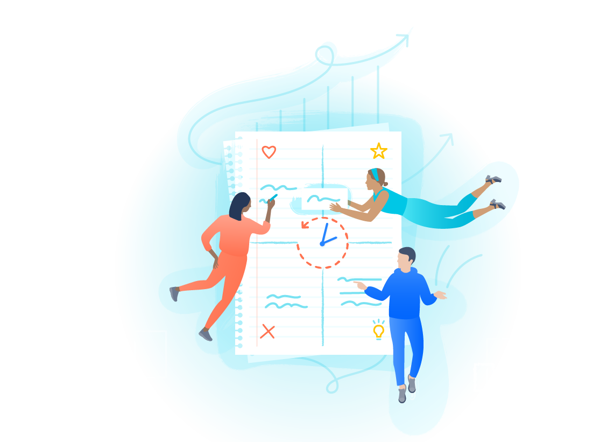
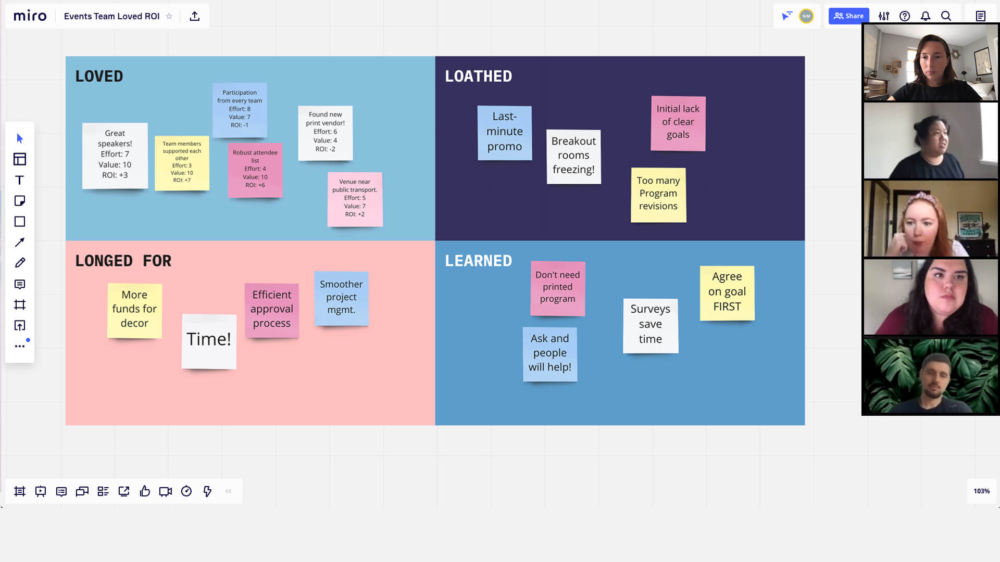
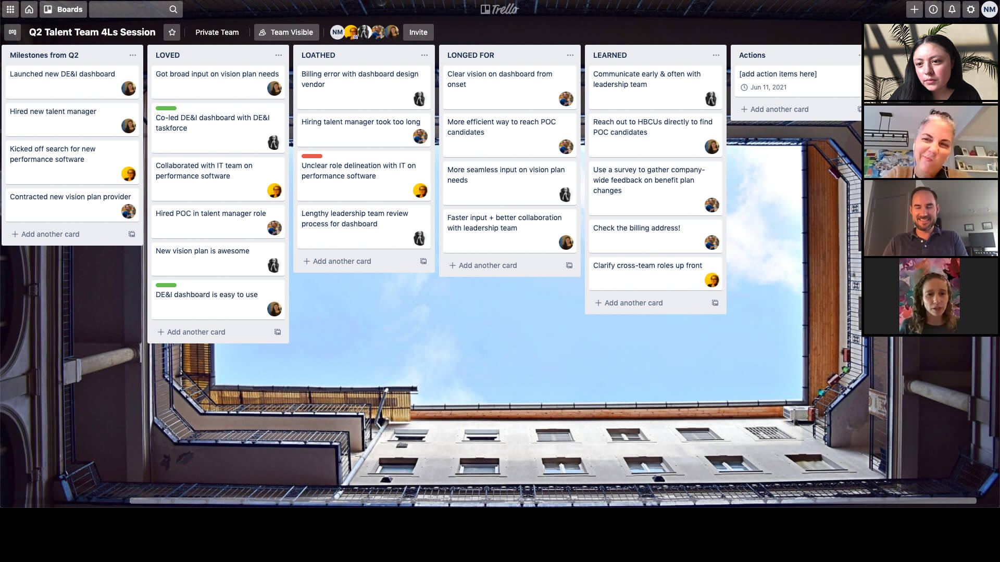
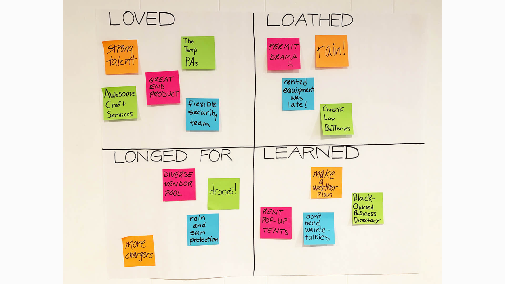
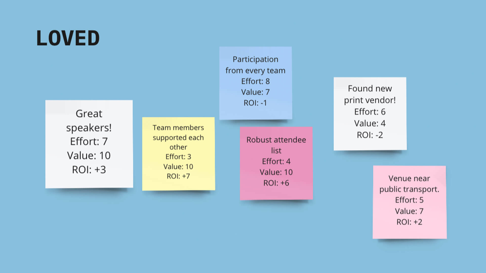

??? cite "Source"
    [:octicons-link-external-16: https://www.atlassian.com/team-playbook/plays/4-ls-retrospective-technique](https://www.atlassian.com/team-playbook/plays/4-ls-retrospective-technique)

The 4 Ls is a retrospective technique where team members identify what they loved, loathed, learned, and longed for in a project or sprint of work. Using this simple framework, reflect back on your work and use what you've learned to improve as a team.

- Prep Time: 5 mins
- Run Time: 60 mins
- People: 2 - 8

## What You'll Need

### Remote

- [X] Video Conferencing with Screen Sharing
- [X] Digital Collaboration Tool (see templates)
- [X] Timer

### In-Person

- [X] Meeting Space
- [X] Whiteboard
- [X] Markers
- [X] Sticky Notes

## Optional Templates

- [X] [:octicons-link-external-16: Confluence Template](https://www.atlassian.com/team-playbook/plays/choose-your-site?templateId=com.atlassian.confluence.plugins.confluence-business-blueprints:4-ls-retrospective-blueprint%2526templateName%253D4%252520Ls%252520Retrospectives)
- [X] [:octicons-link-external-16: Trello Template](https://trello.com/b/vjiiDolu/4ls/atlassianteamplaybook/recommend)
- [X] [:octicons-link-external-16: Miro Template](https://miro.com/templates/4-ls-retrospective/)
- [X] [:octicons-link-external-16: Retrium Template](https://www.retrium.com/retrospective-techniques/4ls)

## Instructions for Running this Play

!!! tip "Tip: Large Groups"
    Have more than 8 people? Set aside 90 minutes for groups of 8-12, and at least 2 hours for more than 12 people.

1. **Prep** `5 MIN`

    For remote teams, start by creating a collaboration document, such as a Trello board or Confluence page. You can use the templates provided, if you’d like, or create one of your own.

    For in-person teams, find a whiteboard or large paper and set out sticky notes and markers in a meeting room.

    Create six columns labeled Milestones, LOVED, LOATHED, LONGED FOR, LEARNED, and Actions.

    Before the session, agree as a team on the time period you’d like to look back on.

    !!! tip "Tip: Last Quarter"
        If your company runs on a quarterly schedule, looking back on the last quarter is a good place to start.

2. **Set the Stage** `5 MIN`

    Let your team know the following at the start of the meeting: 

    - The reason we’re taking the time to talk about how we have worked is to see how we can make improvements. 
    - We’re coming into this meeting understanding that everyone did the best that they could given their knowledge and tools. 
    - This meeting is a safe space. Nothing that is shared will be used against anyone. 
    - We’re here to explore, not to blame.

3. **Key Moments** `5 MIN`

    Have the team think back over the chosen time period. What were the key events that occured? Provide a few examples, such as goals met, team celebrations, team members joining, company events. 

    Anchoring the team in key milestones jogs the team’s memory of events that occurred and how they felt about them.

    Then set a timer for 5 minutes for people to add their own key events to the Milestone column.

4. **Reflect** `10 MIN`

    !!! tip "Tip: Give it Time"
        Giving time to write allows for processing and reflection while also giving quieter team members space for sharing their ideas.

    Explain the four lists to the team: "LOVED," "LONGED FOR," "LOATHED" and "LEARNED.”

    LOVED: what you loved about your work over the time period.

    This is what you want to keep doing, or do more of, in the future.

    !!! example "Example: ROI"
        See how one team captures ROI for their “Loved” responses.
        

    LONGED FOR: what you wish you’d had. 

    It could be more people, more time, more coffee. Nothing is off the table.

    LOATHED: what made life worse back then. 

    What do you hope will never happen again?

    LEARNED: what you learned from your successes and your mistakes.

    Set a timer for 10 minutes for everyone to add their own thoughts to each list.

5. **Decide What to Do** `15 MIN`

    !!! tip "Tip: Focus"
        The fewer actions you have to take, the more likely it is you’ll get them done. Start with just one action item for each list.

    Give everyone 10 minutes, as a team or in breakout groups, to discuss:

    - One action you’ll take to remove something from your LOATHED list.
    - One action you’ll take to amplify something from your LOVED list.  
    - Use your LONGED FOR and LEARNED lists to help shape your ideas for what actions to take.

6. **Share Your Action Plan** `15 MIN`

    Give each person or group a few minutes to share their plan. Use the actions list to capture each action. Make sure to include who will do it, what they are doing, and by when.

7. **Wrap Up** `10 MIN`

    Commit to when you’ll track progress on actions on a regular basis, such as at team meetings or at the next 4Ls.

----

## Follow-Up

### Schedule Your Next 4Ls Play

Once a quarter is a good start. Once you get the hang of it, try every two weeks, once a month, or after the end of a project cycle or sprint.

### Revisit Regularly

Make sure to revisit your 4Ls with the team and check in on the progress of your actions. At the next 4Ls, you can talk about how those actions went.

## Variations

### Quantify

In breakout groups, discuss the benefits of fixing items in your LOATHED list and continuing the things in your LOVED list, assigning each item a Return on Investment (ROI) based on effort and value. Use these values to decide which items to take action on.

!!! example "Example: ROI"
    See how one team captures ROI for their “Loved” responses.        