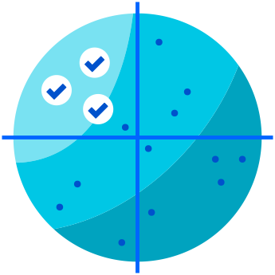
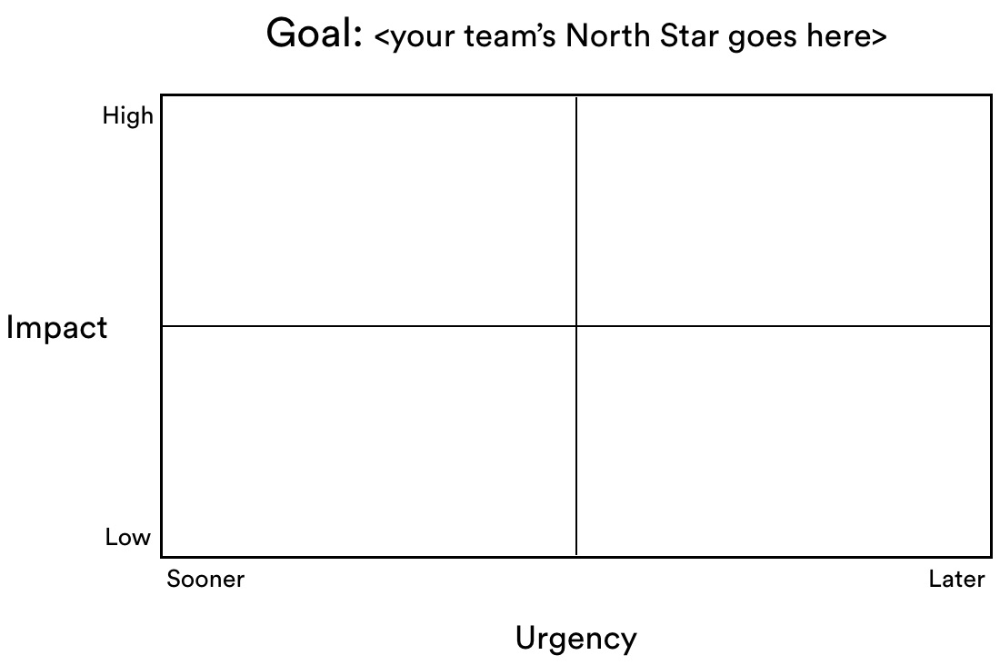
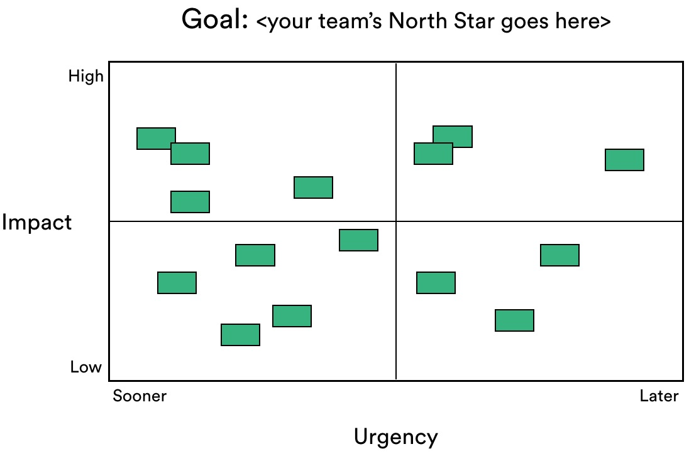
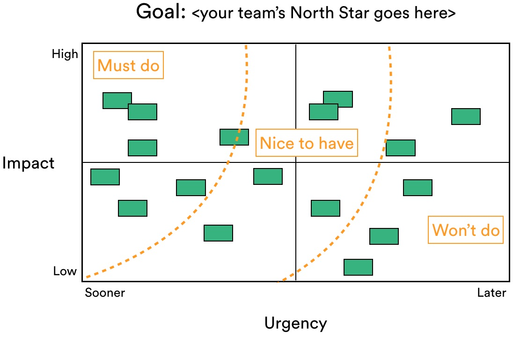
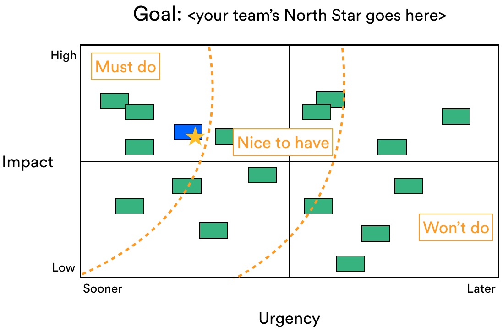
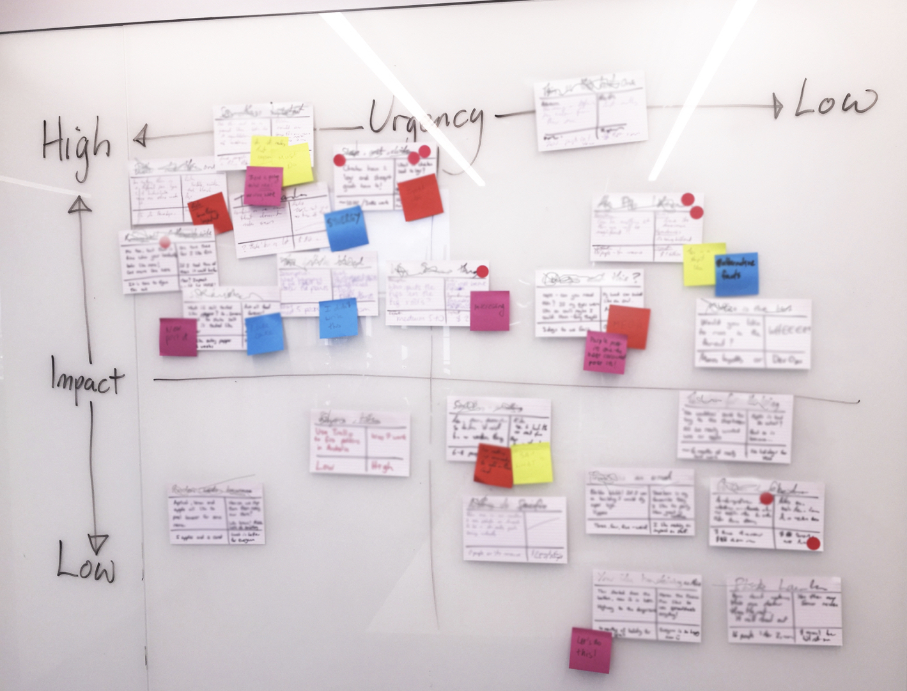

??? cite "Source"
    [:octicons-link-external-16: https://www.atlassian.com/team-playbook/plays/prioritization-matrix](https://www.atlassian.com/team-playbook/plays/prioritization-matrix)

Visualize the relative priority of your own team's projects, then compare it to work requested by other teams.

**USE THIS PLAY TO...**

Make quarterly and annual plans that result in the highest impact, given the resources available. 

If you're struggling with shared understanding or value metrics on your [Health Monitor](../healthmon/index.md), running this play might help.

**AND I NEED THIS... WHY?**

You and your team are at the end of a long and tumultuous planning cycle. You've assessed the relative impact of all the work you could take on, made some tough choices, and emerged with a prioritized set of projects you will take on. You're exhausted, but filled with purpose and hope nonetheless.

Then it happens.

A request comes in from another team. They've just been through the same process, and it turns out, they'll need a contribution from you to achieve their goals. But your own projects already max out your capacity! You want to be a team player, but... how?

If you've ever struggled to prioritized requests from other teams against your existing work, or struggled to get another team to commit to work that your project relies on, this play is for you!

**WHO SHOULD BE INVOLVED?**

All relevant project and/or team leads. Individual contributors and exec sponsors can sit this one out.

- Prep Time: 30 mins
- Run Time: 60 mins
- People: 3 - 6

## What You'll Need

### Remote

- [X] Video Conferencing with Screen Sharing
- [X] Digital Collaboration Tool (see templates)
- [X] Timer

### In-Person

- [X] Meeting Space
- [X] Whiteboard
- [X] Markers
- [X] Sticky Notes
- [X] Index Cards

## Instructions for Running this Play

Some things simply won't get done. And that's ok, as long as you agree to tackle the mission-critical stuff first and work outward from there.

1. **Prep**

    Prior to the session, fill out an index card for every piece of work you're prioritizing. The units of work can be on any scale (tasks, user stories, projects, initiatives, etc.), but it's a lot easier if everything is on a similar scale so you're comparing apples to apples. 

    Each card should describe the four factors you'll take into consideration:

    - [X] Description
    - [X] Expected Outcome
    - [X] Level of Effort
    - [X] Risks and Dependencies

    !!! example
        Follow this pattern for each of your index cards.

        **Name of Project**
        

        -   **Description**

            ---

            What is this and why is it being considered?
        
        -   **Risk & Dependencies**

            ---

            Who else needs to be involved?  
            What could stop the project from being successful?

        -   **Level of Effort**

            ---

            Story points or t-shirt sizes work well here. Be realistic!

        -   **Expected Outcome**

            ---

            How will this add value for customers and/or the business?

        

2. **Set the Stage** `5 MIN`

    Get the group into the right mindset: even though there are multiple teams involved here, we are one company with a common purpose. 

    If we prioritize with this in mind, we stand a fighting chance of coming to a shared understanding of what will (and won't) help us achieve our mission. If we don't, we risk competing against each other and delaying the things that matter most.

3. **Set Up the Matrix** `5 MIN`

    Draw a 2x2 grid on a whiteboard or butcher's paper and write your teams top goals above it. Label the X-axis "Urgency", with "Sooner" on the far-left side and "Later" on the far-right side. Label the Y-axis "Impact", with "Low" at the bottom and "High" at the top. 

    Above the matrix, write your team's most important goal. (Or maybe top 2 goals.)

    

    !!! tip
        Articulating your team's North Star will be much easier if you're green on "shared understanding" in your [Health Monitor](../healthmon/index.md). Otherwise, try running the [OKRs](../okr/index.md), [Goals Signals and Measures](../goalsmeasures/index.md), or [Elevator Pitch](../elevator/index.md) plays before prioritizing.

4. **Prioritize Your Own Team's Work** `20 MIN`

    As a group, stick the cards on the board, positioning them relative to the other cards based on their impact on your goals and how soon they need to be done.

    Discuss the positioning as a group and keep moving the cards until you've got an even distribution across the board. It's natural to start with everything at the top left but spreading them out is crucial.

    

5. **Draw Feasibility Lines** `10 MIN`

    Draw 2 arcs across the board to separate the must-haves from the nice-to-haves and those you probably won't do.

    Anything in the top-left is protected because it simply must be done. Nothing should be in here if it's not vital to achieving the goal. 

    Anything in the bottom right is likely to be pushed out. This doesn't mean it won't ever get done, just not until the more important work is complete.

    Try to limit the "must-haves" to about 40% of your team's capacity, and the "nice-to-haves" to about 30%. This leaves you with some capacity to accommodate the requests you've gotten from other teams – not to mention the hot ones that might will get thrown into your path.

    !!! tip
        Agreeing on what you're prepared to delay or simply not do can lead to some uncomfortable moments. Keeping the group laser-focused on your North Star helps take the edge off.

    

6. **Incorporate the Asks** `15 MIN`

    As you prioritize other teams' requests against what's already on your plate, ask yourselves these questions: 

    Are the other team's goals mission-critical? (Like, at a company level?)
    If you didn't accommodate the other team's request, what impact would that have on their goal?

    Once you've positioned the ask(s), redraw your lines to reflect what you can now achieve. If accommodating the ask means you're putting your own goal at risk, call it out and discuss options. 

    If both teams' goals are mission-critical, talk to leadership about getting additional people. 
    If the other team's goal is mission-critical and yours is not, just do it. (doit)
    If neither teams' goal is mission-critical, you'll need to look at the subtleties and reach an agreement. 

    

    !!! tip
        Whatever the result from this exercise, make sure you communicate the decisions you've made, any resulting risks to achieving your goals and the reasons why.

    !!! example
        Check out a priority matrix created by the Confluence Server team.
        

----

## Follow-Up

Communicate the results of this session to your full project team, stakeholders, and anyone else whose work may be affected. Highlight your reasons for drawing the lines where you did, as well as any risks that remain. 